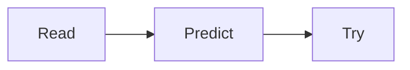

# Reading a value

Hover or focus `toUpperCase` to inspect its type and documentation. The green
learning note explains the concept; it is not a test result or an error.

```ts twoslash
const word = "hello";
word.toUpperCase();
//   ^^^^^^^^^^^
// @annotate: Creates a new string; the original stays unchanged. [MDN reference](https://developer.mozilla.org/en-US/docs/Web/JavaScript/Reference/Global_Objects/String/toUpperCase).
```

## Walk through the change

The same nested code-fence syntax works in Slidev teaching presentations.

````md magic-move
```ts
const score = 2;
```
```ts
const score = 2;
const doubled = score * 2;
```
```ts
const double = (score: number) => score * 2;
```
````

## Other lesson material

1. Read the example.
2. Predict the result.
3. Try it yourself.

An inline formula $a^2 + b^2 = c^2$ and a displayed formula:

$$
\sum_{i=1}^{n} i = \frac{n(n+1)}{2}
$$



## An intentional type error

```ts twoslash
// @errors: 2322
const count: number = "two";
```
